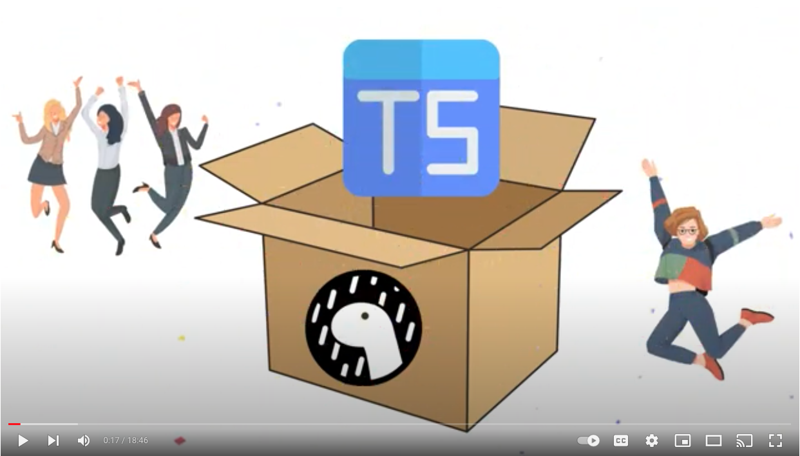

# Get up and running with Express & TS fast with Deno!

This repo holds the code from
[Tim's tutorial on building a REST API with Deno &
Express](https://www.youtube.com/watch?v=TDFv2hBRUtQ):

[](https://www.youtube.com/watch?v=TDFv2hBRUtQ)

To get started:

```
deno task dev
```

You can re-generate the mock user data using the `./generate_data.ts` helper.

To generate and run a Docker image, use:

```sh
docker compose up --build
```

You can then deploy to a wide variety of hosts that support Docker.

## Running Tests & Benchmarks

To run the tests, you need to first start the API service. You can do this with
`deno task start` in one terminal, while you run:

```sh
deno test -A
```

... and ...

```sh
deno bench -A
```

... respectively. See [the Deno manual](https://deno.land/manual) for more
information on even more features in Deno's built-in test runner and benchmark
tool.
